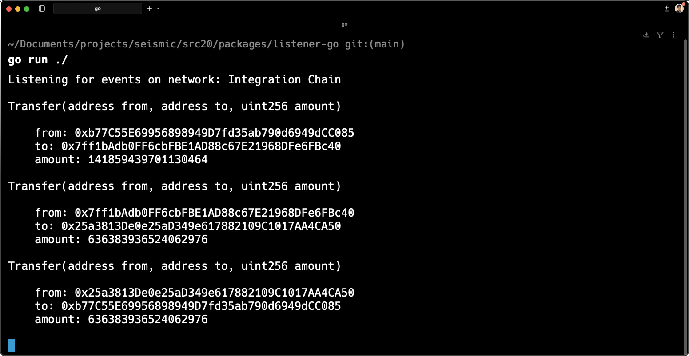

# SRC20
An ERC20 variant with private balances and transfer amounts.

> Note: We're adding SRC20 to Viem mid Dec 2026, so the Typescript clients will be considerably simpler.

## Directory Overview

``` bash
packages/
├── contracts/      # Solidity contracts
├── listener-go/    # Listens to transfer() events in Go
├── listener-ts/    # Listens to transfer() events in Typescript
└── sender-ts/      # Sends transfers in Typescript
```

## Prerequisites 
You need our version of `foundry` (`sfoundry`) to run `contracts/`, `listener-ts`, and `sender-ts`. See [here](https://docs.seismic.systems/getting-started/publish-your-docs) for the installation command.

In addition, all four packages read from a `.env` file in `packages/contracts/`. See `packages/contracts/.env.example` for an example file. 

## Contract Deployment

The following command deploys a fresh SRC20 contract and logs the resulting contract address in `packages/contracts/out/deploy.json`. 

``` bash
cd packages/contracts
bash script/deploy.sh
```

The other three packages use `deploy.json` to point to the current SRC20 contract. Note that running the deploy script again overwrites the old address.

## Sending Transfers

The following command continuously sends SRC20 tokens (the latest deployment) between a set of three EOAs. 

``` bash
cd packages/sender-ts
bun dev
```

## Listening for Events

The following command listens for transfers on the latest deployment of the SRC20 contract. Does so via a Typescript client.

``` bash
cd packages/listener-ts
bun dev
```

To do the same with a Go client, run the following.

``` bash
cd packages/listener-go
go run ./
```

Here's the expected output:



